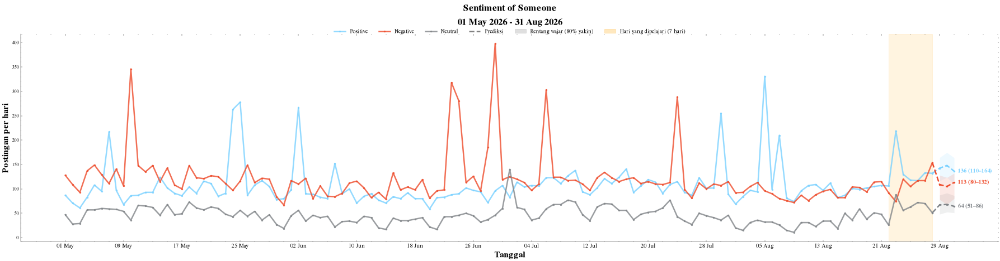

# Sentiment Volume Forecast

Forecast the daily volume of social-media posts (or unique accounts) per sentiment — positive, negative, neutral — from monitoring-tool exports, with an honest accuracy check against past data and an interactive chart.

[](https://colab.research.google.com/github/aldo02032004/sentiment-volume-forecast/blob/main/notebooks/sentiment_volume_forecast.ipynb)


*Example on synthetic data: solid lines = actual daily posts, dashed = forecast, shaded = 80% range, orange = days the model learned from.*

## What it does

1. **Loads** one or more exports straight from Google Drive / Google Sheets links (Excel or a zip of Excel files), retrying on dropped connections and removing duplicate posts across overlapping files.
2. **Counts** posts and unique accounts per day for each sentiment.
3. **Backtests** five forecasting methods on the last 60 days and picks the most accurate one automatically.
4. **Draws** an interactive chart (ipywidgets): choose posts vs. accounts, how many days to forecast, how many days to learn from, and the method.

## How it works

| Method | Idea |
|---|---|
| Hari terakhir (last value) | tomorrow = today |
| Rata-rata (mean) | tomorrow = mean of the learned days |
| Minggu lalu (seasonal naive) | tomorrow = same weekday last week |
| Tren linear (`LinearRegression`) | straight-line trend over the learned days (only for horizons ≤ 4 days) |
| Regresi pintar (`Ridge`) | `log(1 + today)` from `log(1 + yesterday)` + weekend and weekday effects, forecast recursively |

- **Backtest (rolling origin).** For each of the last 60 days the model only sees data up to that day, forecasts the next *H* days, and is compared with what actually happened.
  Accuracy = `1 − Σ|actual − forecast| / Σ actual`.
- **Prediction range.** The shaded band is the forecast plus the 10th–90th percentile of the backtest errors for each step ahead, so it reflects how wrong each method really was, not a textbook assumption.
- **Safe sliders.** Slider limits follow the data length: forecast at most ¼ of the data (max 14 days) and always keep at least 14 backtest runs.

## Results

On a real 123-day monitoring dataset (not included), every option was compared with the same backtest:

| Setting | Regresi pintar | Mean | HistGradientBoosting | ETS (Holt-Winters) |
|---|---|---|---|---|
| Posts, 1 day ahead | **73.6%** | 73.2% | 71.9% | 73.0% |
| Posts, 7 days ahead | **72.1%** | 71.2% | 68.2% | 67.5% |
| Accounts, 1 day ahead | **74.5%** | 73.9% | 68.0% | 71.7% |
| Accounts, 7 days ahead | **72.3%** | 71.4% | 64.6% | 68.5% |

LightGBM, SARIMA and Theta were also tried and did not beat the simple Ridge model while being much slower. With only a few months of daily data, a small regularised regression with weekday effects is the sweet spot.

## Quick start

1. Click **Open in Colab**.
2. In Cell 3, paste your Google Drive / Sheets links into `SOURCES` (sharing: *Anyone with the link*) and set `OBJECT_NAME`.
3. `Runtime → Run all`, then play with the sliders under the chart.

**Try it without your own data:**

```bash
pip install pandas numpy openpyxl
python examples/make_sample_data.py
```

Upload `examples/sample_export.xlsx` to Google Drive, share it as *Anyone with the link*, and paste the link into `SOURCES`.

## Input format

An Excel export with one title row, then a header row containing at least:

`No, Type, Headline, Mentions, Date, Link, Media, Sentiment, Author, Followers, Retweeted, Favourited, Location`

`Date` is an ISO timestamp (`2026-05-01 13:45:00`) and `Sentiment` is `positive` / `negative` / `neutral`. The format is checked with `validate_export` from [GREAT-Tools](https://github.com/azmkto/GREAT-Tools).

## Project structure

```
├── notebooks/
│   └── sentiment_volume_forecast.ipynb   # the whole pipeline, 8 cells
├── examples/
│   ├── make_sample_data.py               # generates a synthetic export
│   └── sample_export.xlsx                # 120 days of synthetic data
├── docs/
│   └── forecast_example.png
├── requirements.txt
└── LICENSE
```

## Limitations

- Needs at least 21 days of data (7 learned days + 14 backtest runs).
- Forecasts are for planning, not certainty: around 72–75% accuracy means a typical day is off by about a quarter.
- Sudden spikes from new issues cannot be predicted from past volume alone.
- Code comments and the chart labels are in Indonesian.

## Built with

[GREAT-Tools](https://github.com/azmkto/GREAT-Tools) (data prep and chart style) · scikit-learn · pandas · NumPy · Matplotlib · ipywidgets

## License

MIT — see [LICENSE](LICENSE).
